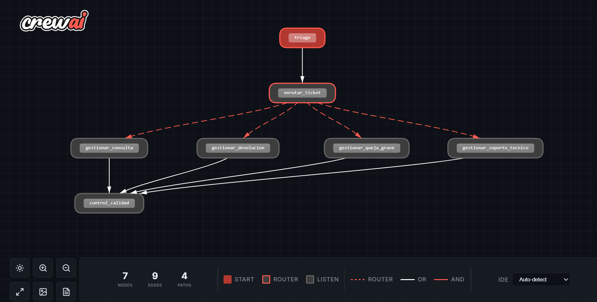
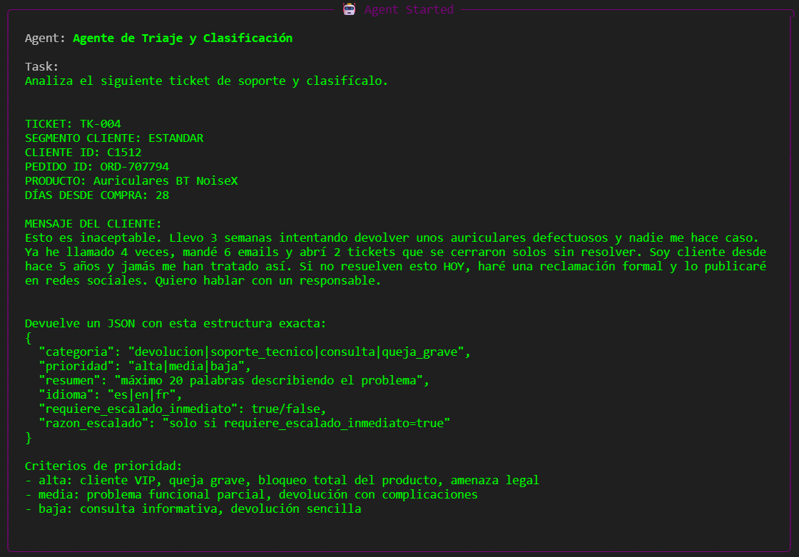
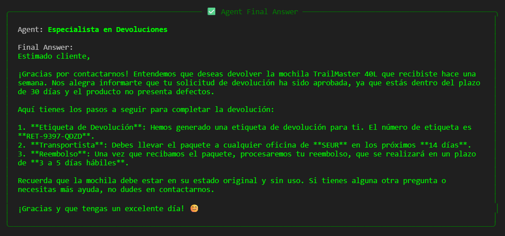

# 🤖 Multi-Agent Customer Service System

This project implements a complete customer service system using a multi-agent artificial intelligence architecture through the **CrewAI** framework. The goal of the system is to simulate a modern customer service department capable of receiving, classifying, and resolving support tickets, routing them to the appropriate specialist agent.


*Figure: The overall execution flow of our multi-agent customer service pipeline, mapping out how tasks are delegated from the initial assessment through to final quality assurance.*

## 🏛️ System Architecture

The system consists of 5 specialized agents:

1. **🔀 Triage and Classification Agent:** Evaluates incoming tickets, classifies them (return, support, complaint, query), assigns them a priority, and sends them to the corresponding specialist.


*Figure: The Triage Agent in action, serving as the starting point of the system by processing an incoming ticket to determine its category and urgency before routing.*

2. **📦 Returns Specialist:** Processes tickets related to refunds and returns.
3. **🔧 Technical Support Specialist:** Handles technical issues using a predefined Knowledge Base.
4. **💬 General Queries Specialist:** Manages questions about orders, company policies, and serious complaints.
5. **✅ Quality Assurance (QA) Agent:** Reviews the responses generated by the specialists, ensuring they meet company standards and have the appropriate tone before being sent to the customer.

### ✨ Example Resolution



## 🛠️ Tech Stack

- **[CrewAI](https://www.crewai.com/):** Orchestration of the multi-agent system.
- **[LangChain](https://www.langchain.com/):** Integration of tools and AI workflows.
- **[OpenAI API](https://openai.com/):** Large Language Models (LLMs), using `gpt-4o-mini`.
- **[Pydantic](https://docs.pydantic.dev/):** Strict data validation for the inputs of the agents' tools.
- **[Faker](https://faker.readthedocs.io/):** Generation of synthetic data (customers, orders, and simulated tickets).
- **[Rich](https://rich.readthedocs.io/):** Advanced console formatting and interactive visual tables.
- **Python 3.10+**

## 🚀 Setup and Usage

### 1. Clone the repository
```bash
git clone <REPOSITORY_URL>
cd <REPOSITORY_NAME>
```

### 2. Install dependencies
Make sure to install the necessary packages found in the notebook:
```bash
pip install crewai crewai-tools openai langchain-openai faker rich langchain-core python-dotenv
```

### 3. Configure Environment Variables
The project uses the OpenAI API to operate the artificial intelligence agents. You must provide your API key.

1. Copy the example environment variables file:
```bash
cp .env.example .env
```
2. Edit the `.env` file and add your OpenAI key:
```env
OPENAI_API_KEY=your_api_key_here
```

### 4. Run the Notebook
Open the main notebook `multiagente_atencion_cliente (1).ipynb` in Jupyter Notebook or VS Code and run the cells to start the multi-agent system.
